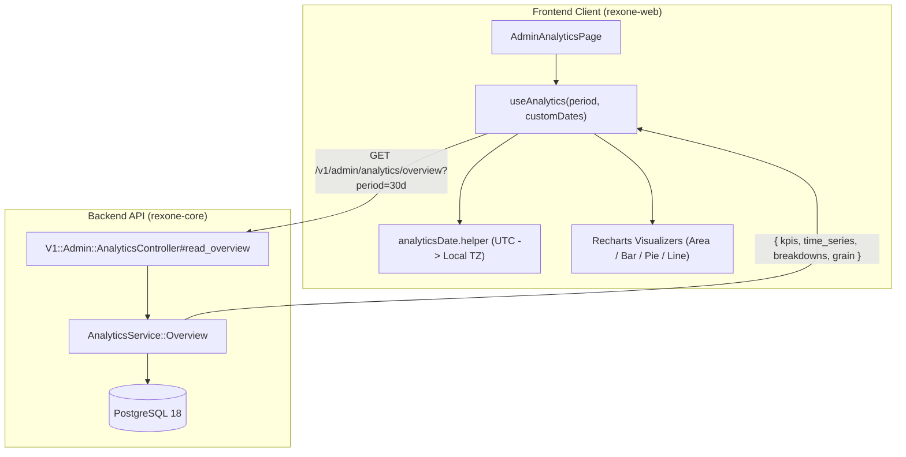

# 📊 Rexone Analytics System & Developer Guide

### A unified, high-performance operational analytics engine for business telemetry, KPIs, and time-series visualizers.

---

> [!IMPORTANT]
> **🏛️ Architectural Law**: The backend computes all analytics in pure **UTC** using grouped SQL aggregations. Timezone localization is strictly executed on the frontend client (`rexone-web`) using the administrator's local browser timezone.
>
> **🚫 Non-Duplication Law**: The Analytics module focuses strictly on **business and user domain telemetry** (revenue, subscriptions, user acquisition, AI usage, client crashes, user feedbacks). Never duplicate server infrastructure metrics (CPU, RAM, DB query latency, queue depth) here—those belong in Rails Pulse / RED dashboards.
>
> **🏷️ Constants Law**: Never use raw string literals. All period ranges and time grains are centralized in `AnalyticsConstants::Period` and `AnalyticsConstants::Grain`.

---

## 🏗️ 1. System Architecture



---

## 📦 2. Core Data Pipeline & Existing Models

Every analytics query flows through [`AnalyticsService::Overview`](file:///Users/rex/Desktop/Dev/rexone/rexone-core/app/services/analytics_service/overview.rb), querying real domain models:

| Section | Method | Output Shape | Existing Models Queried |
|---|---|---|---|
| **KPIs** | `build_kpis` | `Hash<Symbol, Numeric>` | `User.kept`, `Payment::Transaction.kept`, `Payment::Subscription.kept`, `Chat::Message.kept`, `Feedback.kept`, `Log::Client.kept`, `Asset.all`. |
| **Time Series** | `build_time_series` | `Array<Hash>` | Chronological data points grouped by UTC buckets (`hourly`, `daily`, `monthly`) based on date range duration. |
| **Breakdowns** | `build_breakdowns` | `Hash<Symbol, Hash>` | Categorical distributions (e.g. feedback ratings 1..10, subscriptions by cycle, client errors by platform). |

---

## 🚀 3. Step-by-Step: How to Add a New Metric & Chart

Here is a practical, end-to-end example adding **Media Asset Upload Telemetry** using the real [`Asset`](file:///Users/rex/Desktop/Dev/rexone/rexone-core/app/models/asset.rb) model:

---

### Step 1: Compute Data in Rails Backend

Edit [`app/services/analytics_service/overview.rb`](file:///Users/rex/Desktop/Dev/rexone/rexone-core/app/services/analytics_service/overview.rb):

```ruby
# 1. Add KPI & Delta Calculation using real models and domain constants
def build_kpis
  # ... existing KPIs ...
  
  # Current period vs Previous period using real Asset model
  current_assets_count = Asset.uploaded.where(created_at: time_range).count
  prev_assets_count    = Asset.uploaded.where(created_at: prev_time_range).count

  {
    # ...
    total_uploaded_assets: current_assets_count,
    assets_delta_pct: calculate_delta_pct(current_assets_count, prev_assets_count)
  }
end

# 2. Add Time-Series Aggregation
def build_time_series
  buckets = generate_bucket_keys
  
  # Group by bucket in UTC using group_count helper
  assets_by_bucket = group_count(Asset.uploaded.where(created_at: time_range))

  buckets.map do |key, label|
    {
      date: label,
      key: key,
      # ... existing series ...
      uploaded_assets: assets_by_bucket[key] || 0
    }
  end
end

# 3. Add Categorical Breakdown
def build_breakdowns
  assets_by_format = Asset.uploaded
    .where(created_at: time_range)
    .group(:format)
    .count

  {
    # ... existing breakdowns ...
    assets_by_format: assets_by_format
  }
end
```

---

### Step 2: Update OpenAPI Specification & Swagger

Update [`spec/openapi/v1.rb`](file:///Users/rex/Desktop/Dev/rexone/rexone-core/spec/openapi/v1.rb) under `admin_analytics_overview_response`:

```ruby
admin_analytics_overview_response: object(
  # ...
  kpis: object(
    # ...
    total_uploaded_assets: { type: :integer, example: 340 },
    assets_delta_pct: { type: :number, format: :float, example: 12.8 }
  ),
  time_series: array(
    items: object(
      date: { type: :string, format: :date_time },
      key: { type: :string, example: "2026-09-01" },
      uploaded_assets: { type: :integer, example: 18 }
    )
  ),
  breakdowns: object(
    assets_by_format: { type: :object, additionalProperties: true }
  )
)
```

Regenerate Swagger:
```bash
docker exec dev-rexone-core-api bundle exec rake rswag:specs:swaggerize
```

---

### Step 3: Update TypeScript Interfaces in Web Client

Edit [`rexone-web/src/modules/admin/analytics/types.ts`](file:///Users/rex/Desktop/Dev/rexone/rexone-web/src/modules/admin/analytics/types.ts):

```typescript
export interface IAnalyticsKpis {
  // ... existing fields ...
  total_uploaded_assets?: number;
  assets_delta_pct?: number;
}

export interface IAnalyticsTimeSeriesPoint {
  date: string;
  key: string;
  revenue: number;
  transactions: number;
  new_users: number;
  user_messages: number;
  ai_messages: number;
  uploaded_assets?: number; // <-- New field
}

export interface IAnalyticsBreakdowns {
  subscriptions_by_cycle: Record<string, number>;
  feedback_ratings: Record<string, number>;
  errors_by_platform: Record<string, number>;
  assets_by_format?: Record<string, number>; // <-- New breakdown
}
```

---

### Step 4: Create Recharts Visualizer Component

Create a component in [`rexone-web/src/modules/admin/analytics/components/`](file:///Users/rex/Desktop/Dev/rexone/rexone-web/src/modules/admin/analytics/components):

```tsx
// src/modules/admin/analytics/components/AssetUploadsChart.tsx
import React from 'react';
import { ResponsiveContainer, AreaChart, Area, XAxis, YAxis, Tooltip, CartesianGrid } from 'recharts';
import { IAnalyticsTimeSeriesPoint } from '../types';
import { formatUtcToLocalLabel } from '../helpers/analyticsDate.helper';

interface IAssetUploadsChartProps {
  data: IAnalyticsTimeSeriesPoint[];
  grain?: 'hourly' | 'daily' | 'monthly';
}

export const AssetUploadsChart: React.FC<IAssetUploadsChartProps> = ({ data, grain = 'daily' }) => {
  return (
    <div className="rounded-md border border-base-300 bg-base-100 p-4 shadow-sm md:p-5">
      <div className="mb-4">
        <h3 className="text-body-m font-semibold text-base-content">Media & Asset Uploads</h3>
        <p className="text-caption text-base-content opacity-60">Storage asset creation volume over time</p>
      </div>

      <div className="h-72 w-full">
        <ResponsiveContainer width="100%" height="100%">
          <AreaChart data={data} margin={{ top: 10, right: 10, left: -20, bottom: 0 }}>
            <defs>
              <linearGradient id="assetGradient" x1="0" y1="0" x2="0" y2="1">
                <stop offset="5%" stopColor="#38BDF8" stopOpacity={0.4} />
                <stop offset="95%" stopColor="#38BDF8" stopOpacity={0.0} />
              </linearGradient>
            </defs>
            <CartesianGrid strokeDasharray="3 3" vertical={false} stroke="currentColor" className="text-base-300" />
            <XAxis
              dataKey="date"
              tickFormatter={(val: string) => formatUtcToLocalLabel(val, grain)}
              tick={{ fill: 'currentColor', fontSize: 12, opacity: 0.6 }}
            />
            <YAxis tick={{ fill: 'currentColor', fontSize: 12, opacity: 0.6 }} />
            <Tooltip
              content={({ active, payload, label }) => {
                if (!active || !payload?.length) return null;
                const point = payload[0].payload as IAnalyticsTimeSeriesPoint;
                return (
                  <div className="rounded-md border border-base-300 bg-base-100 p-3 shadow-xl">
                    <p className="text-caption font-semibold text-base-content">{formatUtcToLocalLabel(String(label), grain)}</p>
                    <p className="mt-1 text-body-m font-bold text-info">{point.uploaded_assets ?? 0} uploads</p>
                  </div>
                );
              }}
            />
            <Area type="monotone" dataKey="uploaded_assets" stroke="#38BDF8" strokeWidth={2} fill="url(#assetGradient)" />
          </AreaChart>
        </ResponsiveContainer>
      </div>
    </div>
  );
};

export default AssetUploadsChart;
```

Mount it in [`AdminAnalyticsPage.tsx`](file:///Users/rex/Desktop/Dev/rexone/rexone-web/src/modules/admin/analytics/pages/AdminAnalyticsPage.tsx):

```tsx
<div className="grid grid-cols-1 gap-6 lg:grid-cols-2">
  <RevenueChart data={analytics.time_series} grain={analytics.grain} />
  <AssetUploadsChart data={analytics.time_series} grain={analytics.grain} />
</div>
```

---

## ⚙️ 4. Time Range Presets & Grain Matrix

The analytics engine automatically maps presets defined in `AnalyticsConstants::Period`:

| Period Constant | Query String | Duration | Grain Constant | Comparison Window (`prev_time_range`) |
|---|---|---|---|---|
| `Period::TODAY` | `period=today` | Current day (00:00 - 23:59 UTC) | `Grain::HOURLY` | Yesterday (same 24h window) |
| `Period::YESTERDAY` | `period=yesterday` | Previous day (00:00 - 23:59 UTC) | `Grain::HOURLY` | 2 days ago |
| `Period::SEVEN_DAYS` | `period=7d` | Past 7 days | `Grain::DAILY` | Preceding 7 days (7d to 14d ago) |
| `Period::THIRTY_DAYS` | `period=30d` | Past 30 days (default) | `Grain::DAILY` | Preceding 30 days (30d to 60d ago) |
| `Period::THIS_MONTH` | `period=this_month` | Current month-to-date | `Grain::DAILY` | Last month full duration |
| `Period::LAST_MONTH` | `period=last_month` | Complete previous month | `Grain::DAILY` | Two months ago |
| `Period::THIS_YEAR` | `period=this_year` | Current year-to-date | `Grain::MONTHLY` | Previous complete calendar year |
| `Period::LAST_YEAR` | `period=last_year` | Complete previous year | `Grain::MONTHLY` | Two years ago |
| `Period::CUSTOM` | `period=custom&start_date=...&end_date=...` | Arbitrary date picker | Auto: `<=2d` hourly, `<=90d` daily, `>90d` monthly | Exact matching duration immediately preceding `start_date` |

---

## 🛡️ 5. Golden Rules for Analytics

1. **Always Use `.kept` for Soft-Deleted Models**:
   - `User.kept`, `Payment::Transaction.kept`, `Payment::Subscription.kept`, `Chat::Message.kept`, `Feedback.kept`, `Log::Client.kept`.
   - Never query discarded records in operational KPIs unless explicitly auditing the recycle bin.
2. **Never Perform N+1 Queries**:
   - Always group using database aggregations (`group_count`, `group_sum`, `group(:column).count`).
   - Disambiguate column names in joined tables (e.g. `payment_subscriptions: { created_at: time_range }`).
   - Never fetch ActiveRecord models into Ruby memory (`.all.map`) to calculate sums or counts.
3. **Keep Currency Amounts & Revenue Models Consistent**:
   - `Payment::Transaction#price_unit_amount` and `Payment::Product#price_unit_amount` are stored in integer cents.
   - Always combine both one-time transactions (`PaymentConstants::TransactionStatus::SUCCEEDED`) and active subscriptions (`PaymentConstants::SubscriptionStatus::ACTIVE`, `TRIALING`) when computing gross revenue.
   - Always divide cents by `100.0` when formatting revenue output.
4. **Always Use Domain Constants for Statuses, Roles, and Periods**:
   - Periods & Grains: `AnalyticsConstants::Period::*`, `AnalyticsConstants::Grain::*`.
   - Payments: `PaymentConstants::TransactionStatus::SUCCEEDED`, `PaymentConstants::SubscriptionStatus::ACTIVE`, `PaymentConstants::SubscriptionStatus::TRIALING`.
   - Chat & AI: `AiConstants::ChatRole::USER`, `AiConstants::ChatRole::ASSISTANT`.
   - Feedback: `FeedbackConstants::Status::*`, `FeedbackConstants::Category::*`, `FeedbackConstants::Priority::*`.
   - Logs: `LogConstants::Severity::*`, `LogConstants::Platform::*`.
   - Never hardcode raw string literals.
5. **Use DaisyUI Theme Colors for Charts**:
   - Backgrounds: `bg-base-100`, borders: `border-base-300`, text: `text-base-content`.
   - Accents: `primary` (`#FF2238`), `secondary` (`#FF4D2E`), `info` (`#38BDF8`), `success` (`#10B981`), `error` (`#EF4444`).
