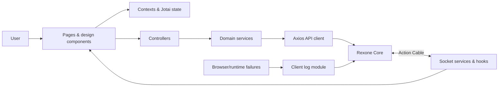

<a id="readme-top"></a>

<div align="center">

# Rexone Web

### A disciplined React client, built to turn a powerful foundation into a clear product experience.

A production-minded web foundation for authenticated products. Identity, payments, access control, media, AI, real-time delivery, localization, client telemetry, and reusable interface primitives meet here—not as isolated demos, but as one coherent browser application.

Built under the same creed as Rexone Core: **clear in thought, exact in structure, simple in use, and strong enough to endure what comes after launch.**

[](https://react.dev/)
[](https://www.typescriptlang.org/)
[](https://vite.dev/)
[](https://tailwindcss.com/)
[](https://playwright.dev/)

**Typed · Modular · Localized · Observable · API-driven · Fully Tested**

[Explore the client](#feature-map) · [Ecosystem Architecture](ECOSYSTEM.md) · [Development Law](LAW.md) · [Analytics Guide](ANALYTICS.md) · [Run it locally](#getting-started) · [Meet the architecture](#architecture) · [E2E Testing](#end-to-end-testing-playwright) · [Connect the API](#configuration)

</div>

---

> [!IMPORTANT]
> **🏛️ Unified Ecosystem**: For the complete cross-platform architecture, feature parity matrix, and communication protocols between Core, Web, and Mobile, see **[ECOSYSTEM.md](ECOSYSTEM.md)**.
>
> **📜 Constitutional Law**: All development must strictly adhere to the architecture, design system, and state laws in **[LAW.md](LAW.md)**. Zero exceptions.

## Why Rexone Web?

A capable backend is only half a product. The browser still has to manage identity, expired sessions, protected navigation, asynchronous failures, payment handoffs, live connections, loading states, localization, and the thousand small interactions that decide whether a system feels dependable.

Rexone Web exists so that work does not have to be improvised for every product built on Rexone Core.

This is not a gallery of components pretending to be an application architecture. Routes, contexts, controllers, services, models, modules, and design primitives have distinct responsibilities. Authentication flows preserve only appropriate state in the URL. API interceptors coordinate credentials and session expiry. Errors leave the browser as structured telemetry. Product capabilities remain grouped by domain instead of dissolving into a global collection of requests and screens.

The client is designed to **bend around the product**, never to make the product kneel before the foundation.

Its boundaries are deliberate. UI components own interaction and presentation. Controllers coordinate application outcomes. Services own transport. Models describe contracts. Contexts own cross-cutting browser state. Modules keep product capabilities together. The result is a foundation that can grow without making every feature depend on every other feature.

And no—the interface was not assembled by stacking dependencies until a demo appeared.

Authentication edge cases were traced. Sensitive passcodes were kept out of URLs. Session replacement and expiry were handled centrally. Runtime and React failures were made observable. Translation keys were organized by domain. Real user journeys are verified by automated Playwright E2E suites. The client is built to remain understandable after the first release, not merely attractive before it.

## The philosophy

Rexone Web follows the same doctrine as the core it serves:

> **Clarity before cleverness. Precision before haste. Simplicity without weakness. Strength without spectacle.**

The difficult part of frontend work is rarely rendering one more screen. It is preserving a system that remains coherent when routes multiply, API contracts evolve, providers fail, languages expand, and product-specific experiences begin to pull in different directions.

So the ambition is not to provide the largest component library or the most elaborate state layer.

It is to provide a **clear client foundation**—strong enough to carry ambitious products, flexible enough to surrender its shape to them, and disciplined enough that the next developer can follow data from interaction to API and back without archaeology.

## Feature map

| Foundation    | What is ready                                                                          | Details                                                |
| ------------- | -------------------------------------------------------------------------------------- | ------------------------------------------------------ |
| Identity      | Email/passcode flows, confirmation, recovery, Google sign-in, session expiry           | [Authentication & security](#authentication--security) |
| Navigation    | Public and protected routes with centralized route definitions                         | [Routing & access](#routing--access)                   |
| Design        | Reusable inputs, buttons, dialogs, overlays, media, themes, and typography             | [Design system](#design-system)                        |
| State         | React contexts, Jotai atoms, and deliberate browser persistence                        | [State & application flow](#state--application-flow)   |
| Commerce      | Product selection, Stripe Checkout handoff, success, and cancellation flows            | [Payments & entitlements](#payments--entitlements)     |
| Media         | Real-time compression tracking, 10MB image / 100MB video uploads, optimal badges       | [Media & assets](#media--assets)                       |
| Speech        | Binary MP3 streaming playback (`/v1/speech/tts`), chat TTS, and live audio recognition | [Speech & audio](#speech--audio)                       |
| AI            | Non-blocking queued chat, durable history, live completion alerts, and language tools  | [AI capabilities](#ai-capabilities)                    |
| Real time     | Action Cable-compatible WebSocket lifecycle and reconnect handling                     | [Real-time delivery](#real-time-delivery)              |
| Localization  | English, Spanish, and Burmese resources with organized typed keys                      | [Localization](#localization)                          |
| Observability | React boundary, global browser capture, structured context, and Core API delivery      | [Client observability](#client-observability)          |
| Admin         | User, role, permission, product, chat, asset, and notification management with RBAC    | [Administration](#administration)                      |
| Testing (E2E) | 19 real user journey specs across 6 auth flows via Playwright Page Object Model        | [End-to-End Testing](#end-to-end-testing-playwright)   |
| Quality       | TypeScript builds, ESLint, Vitest unit tests, Playwright, and production preview       | [Quality toolchain](#quality-toolchain)                |
| Delivery      | Vite production output and a Docker-based development environment                      | [Delivery](#delivery)                                  |

## Architecture

Rexone Web keeps browser concerns explicit and domain behavior grouped.



The main boundaries are:

- `design/` owns pages, reusable components, and visual primitives.
- `modules/` groups domain behavior such as authentication, payments, AI, logging, and administration.
- `controllers/` coordinate responses that are shared outside a single domain module.
- `services/` own HTTP, sockets, persistence, and other transport concerns.
- `contexts/`, hooks, and Jotai atoms own shared client state and lifecycle behavior.
- `models/` describe API envelopes, resources, pagination, users, and application data.
- `constants/` centralizes storage keys, dialog steps, and URL parameters.
- `locales/` owns i18n initialization, typed translation keys, and translation helpers.
- `routes/` owns browser routing and public/protected access boundaries.
- `e2e/` houses Page Objects, fixtures, and Playwright end-to-end specifications.

The UI does not need to know how Axios is configured, and transport code does not decide how a dialog should behave. That separation keeps provider and backend details from spreading through presentation code.

## The client in detail

### Authentication & security

- Email-based account discovery followed by sign-in or registration.
- Six-digit numeric passcode creation, confirmation, and sign-in flows.
- Email confirmation code entry and resend cooldowns.
- Automatic drop-off recovery: returning unconfirmed users route directly to email confirmation OTP.
- Forgot-password and reset-passcode flows.
- Google OAuth sign-in, including the Core challenge flow for new accounts.
- In-memory handling of credentials; sensitive values are deliberately excluded from URL parameters.
- JWT-backed authenticated requests through the centralized Axios client.
- Central handling for expired or replaced sessions, with a localized sign-in message.
- Protected and public route boundaries.
- Google logout coordination for Google-backed accounts.

Authentication delegates identity rules and token authority to Rexone Core while keeping browser behavior, navigation, and feedback cohesive.

### Routing & access

Client and server paths are defined in [`src/AppRoutes.ts`](src/AppRoutes.ts), giving components and services one source of truth.

Public flows include sign-in, sign-up, email confirmation, forgotten passcodes, and passcode reset. Protected flows include home, profile, payment, AI, and sign-out. Access checks and current-user requests use the versioned Core API.

Authentication is presented as a URL-addressable dialog flow. This allows redirects from email links and session expiry to land on the correct step while keeping passcodes in memory rather than browser history.

### IAM & RBAC Administrative Hierarchy

The client enforces a synchronized three-tier administrative hierarchy:

- **`super_admin`**: Complete authority across all features; renders all admin sidebar navigation items.
- **`admin`**: Full authority over domain operations (`feedbacks`, `payments`, `ai`, `assets`, `logs`), strictly excluded from `users` and `iam`. The admin sidebar automatically hides User Management and IAM navigation items.
- **Partial Admins (`*_admin` naming convention)**: Users holding the base `user` role plus a specific `*_admin` role (e.g. `feedback_admin`). Any role with `admin` in the name is treated as an admin role.
  - **Permission Provenance**: Permissions granted to admin roles grant access to both client (`/v1/*`) and admin (`/v1/admin/*`) endpoints. Permissions in non-admin roles (such as `user`) only grant access to `/v1/*`.
  - **Sidebar Visibility**: The admin sidebar dynamically renders **only** the navigation items corresponding to the `read_<resource>` permissions of their assigned `*_admin` role.

### Administration

The client admin panel architecture provides a protected workspace for managing the application under `src/modules/admin/`. It includes:

- **Architecture**: Sidebar navigation, permission-based visibility, and strict route guards (`AdminRootRoute`, `AdminHomeRoute`).
- **Client-Side RBAC**: The `usePermissions` hook evaluates the current user's role and permission matrix to determine access and UI state dynamically.
- **Admin Modules & Dedicated Create/Edit Consoles**:
  - **Users**: User management (`/admin/users`), user creation (`/admin/users/create`), and user edit (`/admin/users/:id/edit`) powered by `AdminUserForm`.
  - **Roles**: Role and permission management (`/admin/roles`), role creation (`/admin/roles/create`), and role edit (`/admin/roles/:id/edit`) powered by `AdminRoleForm`.
  - **Products**: Product and pricing management (`/admin/products`), product creation (`/admin/products/create`), and product edit (`/admin/products/:id/edit`) powered by `AdminProductForm`.
  - **Notifications**: Broadcast dispatch and templates (`/admin/notifications`), template creation (`/admin/notifications/create`), and template edit (`/admin/notifications/:id/edit`) powered by `AdminNotificationForm`.
  - **Accesses**: Entitlements and access management (`/admin/accesses`), access grant console (`/admin/accesses/create`), and validity extension console (`/admin/accesses/:id/edit`) powered by `AdminAccessForm`.
  - **Assets**: Asset control center (`/admin/assets`), batch upload console (`/admin/assets/create`), and asset edit console (`/admin/assets/:id/edit`) powered by `AdminAssetForm`.
  - **Chat**: Moderation tools for chat rooms and messages.
  - **Feedbacks & Logs**: User feedback review and client runtime error telemetry.
- **Form Component Unification**: Every admin module featuring Create and Edit shares a single, reusable `Admin[Entity]Form` component (`mode: CREATE | EDIT`) between its dedicated create and edit route pages. Modals and dialogs are retired in favor of full pages.
- **Table Compactness**: `AdminTableActions` uses compact square icon action buttons (pencil for edit, red bin for delete/discard/revoke, arrow path for restore) to optimize horizontal table space.
- **Data Handling**: Standardized data tables, forms, search filters, and recycle bins for discarded records.

### Design system

The design layer provides reusable:

- Buttons, Google authentication actions, and text links.
- Text, textarea, passcode, dropdown, and toggle inputs.
- Dialogs, toasts, and loading overlays.
- Images, video, profile avatars, and navigation components.
- Color, typography, spacing, radius, shadow, and motion primitives.
- Theme and language controls.

Tailwind CSS, DaisyUI, Headless UI, Heroicons, and `tailwind-merge` provide the implementation substrate without owning the application architecture.

### State & application flow

React contexts coordinate authentication, loading, toast feedback, and error boundaries. Jotai provides lightweight atomic state where shared application state benefits from it. Reusable hooks manage themes, countdowns, sockets, and AI socket behavior.

Browser persistence is used selectively. For example, sign-in cooldown timing survives a refresh, while passcodes do not enter local storage or query parameters.

### Payments & entitlements

The payment module communicates with Rexone Core for:

- Available product retrieval with pagination.
- Stripe Checkout Session creation.
- Payment success and cancellation routes.
- Subscription listing, cancellation, and resumption contracts.
- Transaction retrieval with pagination.
- Access listing and entitlement checks.

Stripe secrets and webhook processing remain on the backend. The browser owns product presentation and secure checkout handoff, not payment authority.

### Real-time delivery

The socket service provides an Action Cable-compatible connection to Rexone Core with authenticated connection setup, message handling, reconnection, and teardown. Shared hooks expose connection state and lifecycle behavior to React features.

This gives product modules a real-time path without coupling components directly to WebSocket protocol details.

### Media & assets

The client provides comprehensive media upload, presentation, and compression management integrated with Rexone Core:

- **Bulk Upload Dialog (`AdminAssetUploadDialog`)**: Multi-file selection queue supporting uploads up to **10 MB** for images/non-videos and **100 MB** for videos when the media container is enabled.
- **Optimistic Table Prepending**: Previews and newly uploaded asset records appear immediately in the asset table upon upload completion rather than blocking until the entire batch completes.
- **Real-Time Cable Compression Sync**: Listens to ActionCable `asset_updated` events over `NotificationChannel`, automatically reflecting status transitions (`pending` $\rightarrow$ `processing` $\rightarrow$ `ready` or `optimal`), updated file sizes, and reduction percentages in real-time.
- **Race-Condition Safeguard (`pendingSocketUpdates`)**: An in-memory buffer catches any socket completion events that arrive before an asset is registered in the table state, merging updates deterministically without dropping events or requiring manual page refreshes.
- **Action Guards**: Action buttons (compress, edit, delete) are dynamically disabled while an asset is in `pending` or `processing` states to prevent race conditions and duplicate jobs.
- **Optimal & Pass Badging**: Renders color-coded status badges (`optimal`, `ready`, `processing`, `pending`) and allows an admin to trigger a manual secondary compression pass (safeguarded by a 2-pass cap).
- **Empty Recycle Bin (`AdminEmptyRecycleBinButton`)**: Built-in modal confirmation button that allows admins to empty all discarded items from the recycle bin in one click, permanently purging database records and remote storage objects.
- **Batch Operations & Multi-Select (`AdminBatchActionBar` & `AdminTable`)**: Support for row checkboxes in `AdminTable`, allowing admins to multi-select items and perform batch discards in the active view, or batch restorations and permanent batch deletions in the recycle bin.
- **Unified Modular Analytics Cards (`AdminKpiCard`)**: High-reusability metric KPI card shared between the Analytics overview and Asset storage capacity dashboards.
- **Presentation Primitives**: Standardized `Asset`, `Image`, and `Video` components prevent raw `` or `<video>` tags and handle loading skeletons, fallbacks, and aspect ratios cleanly.

### Speech & audio

The speech integration provides audio playback and streaming communication with Rexone Core's speech engine:

- **Binary MP3 Audio Streaming**: Direct playback of synthesized audio from `POST /v1/speech/tts` returning raw binary MP3 streams without base64 wrapper overhead.
- **Chat TTS Synthesis**: Asynchronous text-to-speech generation for conversational messages, receiving `tts_ready` notifications via ActionCable and playing attached audio assets.
- **Live Audio Streaming**: Infrastructure ready for WebSocket-based live audio capture and streaming transcription (`SpeechLiveChannel`).

### AI capabilities

The AI module supports the Core API contracts for:

- Non-blocking conversational chat backed by durable queued processing in Rexone Core.
- Persisted rooms, messages, history, and processing state across navigation, refreshes, and closed sessions.
- Clear “AI is thinking” feedback with additional submissions disabled only for the room being processed.
- Real-time completion and failure events through the shared notification socket channel.
- Automatic history refresh when a completed response belongs to the room currently on screen.
- Global success or failure alerts while the user browses elsewhere in the application.
- Room creation, deletion, and renaming with pagination.
- Conversation clearing.
- Summarization.
- Translation.
- Analysis.

The browser owns interaction and presentation, not the lifetime of AI work. A user can leave the page or close the browser without losing the request; the persisted assistant response is waiting in history when they return. Prompts, provider credentials, queue execution, retries, and DeepSeek integration remain behind the Core service boundary.

### Localization

i18next and react-i18next provide runtime localization with English, Spanish, and Burmese resources.

Translation keys are organized by module in [`src/locales/app_locales.ts`](src/locales/app_locales.ts), producing discoverable paths such as `AppLocales.Auth.SignInPasscode.Title`. React components use the reactive `useTranslate()` helper, while services use `translate()` outside React lifecycle rules.

Every API request also carries the selected supported locale in the `X-Locale` header. Rexone Core currently accepts English and Burmese, so unsupported client locales—including Spanish—are mapped to English for backend messages.

The structure is intended to stay navigable as product copy grows rather than becoming one flat catalog of unrelated messages.

### Client observability

Frontend failures are treated as operational data, not console debris.

- A React error boundary records render failures with component stacks.
- Global initialization captures browser runtime failures.
- Client reports can include stack traces, event context, route, platform, browser, operating system, device information, storage snapshots, severity, and occurrence data.
- Authenticated requests associate failures with the current user when available.
- Logs are delivered to `POST /v1/log/clients` and become visible in the Rexone Core administration and error workflows.

This complements backend exception tracking: the server explains what failed there, while client telemetry explains what the user actually experienced here.

### Administration & Role-Based Access Control (RBAC)

The web client includes a dedicated Client Admin Portal (`/admin/*`) providing operational management across Overview, Commerce, Communication, IAM, and Observability.

- **Admin Portal Entry Gate**: Users holding only non-admin roles (e.g. `user`, `subscriber`) have ZERO access to the Admin Portal. All `/admin/*` routes render `NotFoundPage` (404), even if non-admin roles contain permissions.
- **Strict Role Scoping & Non-Admin Isolation**: Admin capabilities are evaluated strictly against active **admin roles** (`super_admin`, `admin`, `*_admin`). Permissions granted under base/non-admin roles (`user`) are ignored and never leak into the admin portal.
  - _Example_: A user holding `chat_admin` and `user` with `read_logs` under `user` can access `/admin/chat/*` but cannot see or access `/admin/log`.
  - _Example_: A user holding `log_admin` with `read_logs` under `log_admin` can see and access `/admin/log`.
- **Granular CUD UI & Route Protection**:
  - **Create**: Create buttons in `<PageHeader>` and table headers are gated by `can(ADMIN_ACTIONS.CREATE, resource)`; `/admin/<resource>/new` is guarded by `AdminRootRoute(action: CREATE)`.
  - **Update**: Edit, review, and extend buttons are gated by `can(ADMIN_ACTIONS.UPDATE, resource)`; `/admin/<resource>/:id/edit` is guarded by `AdminRootRoute(action: UPDATE)`.
  - **Delete**: Discard, restore (`undiscard`), destroy, and revoke buttons are gated by `can(ADMIN_ACTIONS.DELETE, resource)`. The Recycle Bin tab in `<Tabs>` and `/admin/<resource>/discarded` route are accessible ONLY with `ADMIN_ACTIONS.DELETE` permission.
  - **Read**: Sidebar nav links and list pages require `can(ADMIN_ACTIONS.READ, resource)`.

---

## Quality toolchain

- **TypeScript Project Builds** for strict compile-time type safety.
- **ESLint** with React Hooks and React Refresh rules.
- **Vitest** for automated unit and component tests.
- **Playwright** for end-to-end user journey verification.
- **Vite** production builds and local production preview.
- Dependency and browser-baseline checks through the npm toolchain.

## Getting started

### Prerequisites

- Node.js `22.13.0` or newer
- npm `10` or newer
- A running [Rexone Core](https://github.com/rex-9/rexone-core) API
- Docker with Docker Compose, if using the containerized development path

### 1. Clone and configure

```bash
git clone https://github.com/rex-9/rexone-web.git
cd rexone-web
cp .env.example .env
```

Set the Core HTTP and WebSocket URLs and provide a Google OAuth client ID if exercising Google sign-in.

### 2. Install and run natively

```bash
npm install
npm run dev
```

By default Vite listens on all interfaces. The checked-in development environment maps the client to [http://localhost:4000](http://localhost:4000).

The convenience script runs the Docker development stack:

```bash
./scripts/dev.sh
```

### 3. Run with Docker Compose

```bash
docker compose -f docker-compose.dev.yaml up --build
```

The development service mounts the repository into the container, keeps container-managed `node_modules`, and publishes the port configured by `VITE_REACT_APP_PORT_MAP`.

## End-to-End Testing (Playwright)

Rexone Web includes a production-grade E2E test suite built with **[Playwright](https://playwright.dev/)**. Following Rails RSpec conventions, tests are organized by complete user journeys with deterministic setup, explicit state transitions, and meaningful boundary assertions.

### Test Structure

```text
e2e/
├── data/
│   └── users.ts               # Centralized test users & dynamic user factory
├── helpers/
│   └── api.ts                 # API helpers using standard application routes
├── pages/                     # Page Object Model (POM) layer
│   ├── auth.page.ts           # Initial email entry dialog
│   ├── confirm-email.page.ts  # 6-digit OTP verification dialog
│   ├── forgot-password.page.ts # Password reset request dialog
│   ├── home.page.ts           # Authenticated home page
│   ├── sign-in-password.page.ts # 6-digit sign-in password dialog
│   ├── sign-up-info.page.ts   # Name & username profile dialog
│   └── sign-up-password.page.ts # Password creation & confirmation dialogs
└── specs/
    └── auth/
        ├── password.spec.ts       # Password acceptance, mismatch, retry, state persistence
        ├── password-reset.spec.ts # Forgot password, email delivery, 60s cooldown timer
        ├── sign-in.spec.ts        # Sign in, wrong password, attempts countdown, 30s lockout, drop-off recovery
        ├── sign-out.spec.ts       # Sign out & session revocation
        ├── sign-up.spec.ts        # Full registration journey, validations, sanitization
        └── sso.spec.ts            # Google SSO authentication & challenge token setup
```

### Running Tests

Rexone Web provides specialized and unified test runner scripts in [`scripts/`](scripts/):

```bash
# 1. Run FULL test suite (Unit + E2E)
./scripts/test.sh
# or: npm run test:all

# 2. Run ONLY Unit tests (Vitest) - fast feedback loop
./scripts/test_unit.sh
# or: npm run test:unit

# 3. Run ONLY E2E tests (Playwright)
./scripts/test_e2e.sh
# or: npm run test:e2e

# Run specific E2E flows
./scripts/test_e2e.sh sign-in        # Sign-in flow, attempt limits, unconfirmed recovery
./scripts/test_e2e.sh sign-up        # Registration & input validations
./scripts/test_e2e.sh password       # Password matching & retries
./scripts/test_e2e.sh password-reset # Reset request & cooldowns
./scripts/test_e2e.sh sso            # Google SSO authentication
./scripts/test_e2e.sh sign-out       # Sign-out & session termination

# Interactive & Debugging Modes
./scripts/test_e2e.sh --headed       # Watch tests in a real browser window
./scripts/test_e2e.sh --ui           # Open Playwright's interactive visual UI
./scripts/test_e2e.sh --debug        # Launch Playwright step-by-step inspector
```

### Test Guarantees

- **No Fake Routes**: Tests interact only with real application routes and existing controllers.
- **Database Safety**: Tests use dynamic user factories (`generateTestUser()`) for mutation tests to ensure zero data pollution.
- **Page Object Encapsulation**: Selectors, actions, and form interactions are centralized in Page Objects.
- **Typed Constants**: All routes, steps, and storage keys use centralized `AppRoutes`, `DialogParams`, and `DialogAuthSteps` constants.

---

Production assets are written to `dist/`.

## Configuration

The checked-in [`.env.example`](.env.example) documents the client settings.

| Variable                              | Purpose                                                                                      | Development default     |
| ------------------------------------- | -------------------------------------------------------------------------------------------- | ----------------------- |
| `NODE_ENV`                            | Runtime environment label                                                                    | `development`           |
| `VITE_REACT_APP_NAME`                 | Application display name                                                                     | `rexone.me`             |
| `VITE_REACT_APP_GOOGLE_CLIENT_ID`     | Google OAuth browser client ID                                                               | Empty                   |
| `VITE_REACT_APP_GOOGLE_CLIENT_SECRET` | Legacy checked-in configuration field; browser apps should not receive Google client secrets | Empty                   |
| `VITE_REACT_APP_SERVER_BASE_URL`      | Rexone Core HTTP base URL                                                                    | `http://localhost:3000` |
| `VITE_REACT_APP_CLIENT_BASE_URL`      | Public web client base URL                                                                   | `http://localhost:4000` |
| `VITE_REACT_APP_SERVER_WS_BASE_URL`   | Rexone Core WebSocket base URL                                                               | `ws://localhost:3000`   |
| `VITE_PORT`                           | Vite dev server local port                                                                   | `4000`                  |
| `VITE_REACT_APP_PORT_MAP`             | Docker host/container port mapping                                                           | `4000:4000`             |
| `VITE_REACT_APP_DOCKERFILE`           | Dockerfile selected by Compose                                                               | `Dockerfile.dev`        |
| `VITE_MEDIA_MAX_NON_VIDEO_SIZE_MB`    | Maximum upload size for non-video files (MB)                                                 | `10`                    |
| `VITE_MEDIA_MAX_VIDEO_SIZE_MB`        | Maximum upload size for video files (MB)                                                     | `100`                   |
| `VITE_MEDIA_MAX_FILE_COUNT`           | Maximum batch upload count                                                                   | `20`                    |

All frontend environment variables are centralized through [`src/AppConfig.tsx`](src/AppConfig.tsx) (`AppConfig.*`). Only variables prefixed with `VITE_` are exposed to browser code. Never place private credentials or provider secrets in them. In particular, Google client secrets belong on a trusted backend or provider configuration, not in a Vite application.

## Client route surface

| Access    | Route                  | Purpose                                     |
| --------- | ---------------------- | ------------------------------------------- |
| Public    | `/`                    | Root experience                             |
| Public    | `/signin`              | Open the authentication dialog              |
| Public    | `/signup`              | Enter the account creation flow             |
| Public    | `/email/confirm`       | Handle confirmation links or code entry     |
| Public    | `/password/forgot`     | Request account recovery                    |
| Public    | `/password/reset`      | Complete password reset links               |
| Public    | `/anapana`             | Anapana interval reminder                   |
| Protected | `/home`                | Authenticated home                          |
| Protected | `/profile`             | Current-user profile                        |
| Protected | `/payment`             | Products and checkout                       |
| Protected | `/payment/success`     | Checkout success return                     |
| Protected | `/payment/cancel`      | Checkout cancellation return                |
| Protected | `/ai`                  | AI workspace                                |
| Protected | `/signout`             | Sign out and provider cleanup               |
| Protected | `/admin`                       | Admin panel entry with smart redirect           |
| Protected | `/admin/users`                 | User management (super admin only)              |
| Protected | `/admin/users/create`          | User creation console                           |
| Protected | `/admin/users/:id/edit`        | User edit console                               |
| Protected | `/admin/roles`                 | Role and permission management                  |
| Protected | `/admin/roles/create`          | Role creation console                           |
| Protected | `/admin/roles/:id/edit`        | Role edit console                               |
| Protected | `/admin/products`              | Product and pricing management                  |
| Protected | `/admin/products/create`       | Product creation console                        |
| Protected | `/admin/products/:id/edit`     | Product edit console                            |
| Protected | `/admin/accesses`              | Entitlements and user access management         |
| Protected | `/admin/accesses/create`       | Access grant console                            |
| Protected | `/admin/accesses/:id/edit`     | Access validity extension console               |
| Protected | `/admin/assets`                | Asset control center & storage overview         |
| Protected | `/admin/assets/create`         | Asset upload console                            |
| Protected | `/admin/assets/:id/edit`       | Asset edit and compression console              |
| Protected | `/admin/notifications`         | Broadcast notification dispatch & templates     |
| Protected | `/admin/notifications/create`  | Notification template creation console          |
| Protected | `/admin/notifications/:id/edit`| Notification template edit console              |
| Protected | `/admin/chat/rooms`            | Chat room moderation                            |
| Protected | `/admin/chat/messages`         | Chat message moderation                         |
| Protected | `/admin/feedback`              | User feedback management                        |
| Protected | `/admin/logs`                  | Client error and telemetry logs                 |

[`src/AppRoutes.ts`](src/AppRoutes.ts) is the client-side source of truth. Rexone Core's OpenAPI page at `/api-docs` and its `config/routes.rb` remain authoritative for server contracts.

## Project structure

```text
rexone-web/
├── e2e/                 # Playwright End-to-End test suite
│   ├── data/            # Centralized test users & factories
│   ├── helpers/         # Standard API interaction helpers
│   ├── pages/           # Page Object Model (POM) classes
│   └── specs/           # User journey test specifications
├── scripts/             # Development & test automation scripts
│   ├── dev.sh           # Local Vite development server
│   ├── test.sh          # Full test suite runner (Unit + E2E)
│   ├── test_unit.sh     # Vitest unit test runner
│   └── test_e2e.sh      # Playwright E2E runner CLI
├── src/
│   ├── assets/          # Static application media
│   ├── constants/       # Storage keys, dialog steps, and route parameter constants
│   ├── contexts/        # Authentication, loading, toast, and error boundaries
│   ├── controllers/     # Cross-domain application coordination
│   ├── design/          # Pages, components, and visual primitives
│   ├── helpers/         # Shared utilities
│   ├── hooks/           # Reusable React lifecycle behavior
│   ├── locales/         # i18n resources, typed keys, and translation helpers
│   ├── models/          # API and application data contracts
│   ├── modules/         # Auth, payments, AI, logs, admin, and product domains
│   ├── routes/          # Router and access boundaries
│   ├── services/        # HTTP, sockets, persistence, and shared transport
│   ├── AppConfig.tsx    # Environment-backed client configuration
│   ├── AppRoutes.ts     # Client and Core API route constants
│   └── main.tsx         # Browser entrypoint and telemetry initialization
├── Dockerfile.dev
├── docker-compose.dev.yaml
├── package.json
├── playwright.config.ts # Playwright E2E test configuration
├── tsconfig.json
├── vite.config.ts
└── vitest.config.ts
```

## Delivery

`npm run build` performs a TypeScript project build followed by an optimized Vite build. Serve the resulting `dist/` directory from a static host, CDN, container, or frontend platform with SPA fallback configured for browser routes.

For production deployments:

1. Point HTTP and WebSocket variables at the deployed Rexone Core instance.
2. Configure the Google OAuth client for the production origin.
3. Serve the client over TLS and use `wss://` for real-time traffic.
4. Keep secrets in Rexone Core or the relevant provider—not in Vite variables.
5. Run `npm run build`, `npm run lint`, `npm test`, and `./scripts/test.sh` in CI.

## Other Repos in Rexone Ecosystem

- [Rexone Core](https://github.com/rex-9/rexone-core) — Rails API, IAM, payments, jobs, notifications, storage, AI, administration, and observability
- [Rexone Mobile](https://github.com/rex-9/rexone_mobile) — mobile client

## 🎨 Rebranding

Rexone Web can be rebranded directly via the master rebranding engine in `rexone-core` or standalone:

```bash
# 1. From rexone-core (rebrands all 3 repositories):
cd ../rexone-core && ./scripts/rebrand.sh

# 2. Local variables in .env.*:
VITE_APP_NAME="My New App Name"
```

---

## 🏛️ Ecosystem Lineage & Attribution

This application is built on top of the **Rexone Ecosystem** (`rex-9`). When creating derivative products or white-label applications:

- Developers and creators are warmly encouraged to preserve ecosystem credit in documentation to support the project.
- All development must strictly adhere to the constitutional engineering standards in **[LAW.md](LAW.md)** and **[ECOSYSTEM.md](ECOSYSTEM.md)**.

---

## Support the project

If Rexone Web saves you a few weeks—or saves your users from one memorable edge case—consider giving it a star. 🌟

[](https://github.com/rex-9/rexone-web)

## Author

Built with Clarity & Simplicity Driven Development, by **Rex (Rex9)**.

A software engineer, full-stack architect, and long-time practitioner of meditation.

I build systems the same way I approach the path itself: **with a clear mind, deliberate steps, and no unnecessary weight.**

- GitHub: [@rex-9](https://github.com/rex-9)
- Portfolio: [rex9.vercel.app](https://rex9.vercel.app)
- LinkedIn: [rex9](https://www.linkedin.com/in/rex9/)

_Built with ❤️ by Rex9 on Rexone Ecosystem_

<p align="right"><a href="#readme-top">Back to top ↑</a></p>
